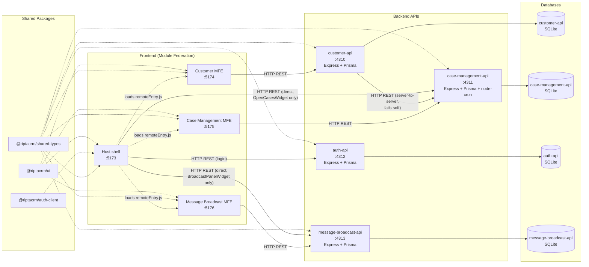

# RiptaCRM Architecture

How the modules are wired together at runtime: which frontends load which via Module Federation, which backends they call, and which shared packages each depends on.

## Nodes

| Node | Tech | Port | Role |
|---|---|---|---|
| Host | React + Vite + MUI + react-router, Module Federation **host** | 5173 | Shell app: login, nav, dashboard, hosts the two remotes |
| Customer MFE | React + Vite, Module Federation **remote** (`customer`) | 5174 | Customer search / create / detail UI |
| Case Management MFE | React + Vite, Module Federation **remote** (`caseManagement`) | 5175 | Case-type / workflow admin config UI + action log viewer |
| Message Broadcast MFE | React + Vite, Module Federation **remote** (`messageBroadcast`) | 5176 | Admin composer + list UI for broadcast announcements |
| customer-api | Express + Prisma + SQLite | 4310 | Customer & interaction-history REST API |
| case-management-api | Express + Prisma + SQLite + node-cron | 4311 | Case type / workflow / instance / SLA REST API + SLA scheduler |
| auth-api | Express + Prisma + SQLite | 4312 | Login / JWT issuance REST API — bcrypt-hashed passwords, no other endpoints |
| message-broadcast-api | Express + Prisma + SQLite | 4313 | Broadcast announcement CRUD + role/validity-filtered active-list REST API |

## Shared packages

| Package | Contains | Consumed by |
|---|---|---|
| `@riptacrm/shared-types` | Cross-cutting TS types/DTOs (customer, case, interaction, nav, user, auth, broadcast) | All 8 services |
| `@riptacrm/auth-client` | Auth context + JWT-backed API auth provider (`useAuth()`) | Host only |
| `@riptacrm/ui` | Shared MUI theme | Host, Customer MFE, Case Management MFE, Message Broadcast MFE |

## The two asymmetric edges

Every other cross-service call is straightforward — each MFE talks only to its own backend, and `customer-api` calls `case-management-api` server-to-server to embed a customer's open cases into `GET /api/customers/:id`.

The Host's Dashboard has two widgets that are the exception, for the same underlying reason: **"Open Cases" widget** calls `case-management-api` directly from the browser (`GET /api/case-instances?assignedToUserId=...&status=OPEN`), and **"Announcements" (`BroadcastPanelWidget`)** calls `message-broadcast-api` directly (`GET /api/broadcasts/active?role=...`) — both bypass their MFE and any other backend entirely. This is intentional in both cases — the data each widget needs (cases assigned to the logged-in user; announcements active for the logged-in user's role) isn't scoped to a specific customer or record, so routing either through `customer-api` or the Case Management/Message Broadcast MFEs wouldn't make sense. Don't "fix" either of these into a Module Federation call or a proxy without checking why it's a direct call first.

Each API owns its own isolated SQLite database via its own Prisma schema — there is no shared database and no direct DB-to-DB access.

## Auth: client-side JWT, no `/me` endpoint

`auth-api` only exposes `POST /api/auth/login` (plus `/health`). It signs a JWT containing the user's id/name/email/role and returns it; the Host decodes and checks the token's expiry **locally**, with no further network calls to `auth-api` on page load or navigation — there's deliberately no `/me` or refresh endpoint yet. This keeps the login flow snappy (no round trip just to render the shell) and matches how modern SSO/OIDC bridges (including SAML gateways) already speak JWT, so swapping the credential-checking logic behind `POST /api/auth/login` for a real identity provider later doesn't require changing how the rest of the app consumes `useAuth()`.

## Message Broadcast: interval polling, not long-polling or WebSockets

`BroadcastPanelWidget` re-fetches `GET /api/broadcasts/active?role=...` on a 45-second `setInterval`, not via long-polling or a WebSocket — this is the first (and so far only) auto-refreshing UI in the codebase. Interval polling was chosen deliberately: every other piece of client-server communication in this app is a one-shot REST call, so a plain timer keeps the same mental model, and because each tick is a fresh, stateless request, there's no open-connection state to track or recover if it drops — unlike long-polling, which needs its own "resume polling if nothing came back for a while" logic. `message-broadcast-api` has no server-side auth check on `/active` (matching every other backend in this codebase — see below), so it's a plain unauthenticated poll, not a subscription.
