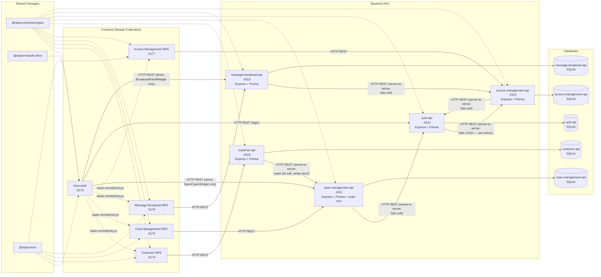

# RiptaCRM Architecture

How the modules are wired together at runtime: which frontends load which via Module Federation, which backends they call, and which shared packages each depends on.

## Nodes

| Node | Tech | Port | Role |
|---|---|---|---|
| Host | React + Vite + MUI + react-router, Module Federation **host** | 5173 | Shell app: login, nav, dashboard, hosts the four remotes |
| Customer MFE | React + Vite, Module Federation **remote** (`customer`) | 5174 | Customer search / create / detail UI |
| Case Management MFE | React + Vite, Module Federation **remote** (`caseManagement`) | 5175 | Case-type / workflow admin config UI + action log viewer |
| Message Broadcast MFE | React + Vite, Module Federation **remote** (`messageBroadcast`) | 5176 | Admin composer + list UI for broadcast announcements |
| Access Management MFE | React + Vite, Module Federation **remote** (`accessManagement`) | 5177 | Profile CRUD/archive, user↔profile assignment, and a read-only Users overview |
| customer-api | Express + Prisma + SQLite | 4310 | Customer & interaction-history REST API |
| case-management-api | Express + Prisma + SQLite + node-cron | 4311 | Case type / workflow / instance / SLA REST API + SLA scheduler |
| auth-api | Express + Prisma + SQLite | 4312 | Login / JWT issuance REST API — bcrypt-hashed passwords; resolves the logged-in user's Profile(s) from access-management-api on every login (see below); also a minimal `GET /api/users` read endpoint used by case-management-api's and access-management-api's member pickers |
| message-broadcast-api | Express + Prisma + SQLite | 4313 | Broadcast announcement CRUD + profile/validity-filtered active-list REST API |
| access-management-api | Express + Prisma + SQLite | 4314 | Profile CRUD/archive + user↔profile membership REST API — the source of truth for what every session's Profile grants |

## Shared packages

| Package | Contains | Consumed by |
|---|---|---|
| `@riptacrm/shared-types` | Cross-cutting TS types/DTOs (customer, case, interaction, nav, nav registry, user, profile, broadcast) | All 10 services |
| `@riptacrm/auth-client` | Auth context + JWT-backed API auth provider (`useAuth()`) | Host only |
| `@riptacrm/ui` | Shared MUI theme | Host, Customer MFE, Case Management MFE, Message Broadcast MFE, Access Management MFE |

## The asymmetric edges

Every other cross-service call is straightforward — each MFE talks only to its own backend, and cross-service data flows through the caller's own backend as a server-to-server proxy. `customer-api` calls `case-management-api` server-to-server both to embed a customer's open cases into `GET /api/customers/:id` (read, fails soft) and — for the Customer module's "Lodge a Case" flow — to list lodgeable case types, fetch a case type version's fields, and create the case instance itself (`POST /api/case-instances`, the first *write* proxy in the codebase; deliberately **not** fail-soft, since a write failure has to reach the user as a real error, not get swallowed into a fake success). `case-management-api` and, more recently, `access-management-api` each call `auth-api` server-to-server (`GET /api/users`, fails soft to an empty list) so their member pickers (Queues; Profiles) can offer a real user list instead of free-typed IDs. `message-broadcast-api` calls `access-management-api` the same way (`GET /api/profiles`, fails soft to an empty list) to power its composer's "target profiles" checkbox list.

Three edges genuinely deviate from that pattern:

- **The Host's Dashboard widgets** — **"Open Cases" widget** calls `case-management-api` directly from the browser (`GET /api/case-instances?assignedToUserId=...&status=OPEN`), and **"Announcements" (`BroadcastPanelWidget`)** calls `message-broadcast-api` directly (`GET /api/broadcasts/active?profileId=...`) — both bypass their MFE and any other backend entirely. This is intentional in both cases — the data each widget needs (cases assigned to the logged-in user; announcements active for the logged-in user's active Profile) isn't scoped to a specific customer or record, so routing either through `customer-api` or the Case Management/Message Broadcast MFEs wouldn't make sense.
- **`auth-api` → `access-management-api` on login** (`GET /api/profiles?userId=...`) is the one edge in the whole codebase that deliberately **fails loud** instead of soft. Every other cross-service read here degrades gracefully — a shorter picker list, an empty widget — because the caller can still do something useful with partial data. Login can't: if `access-management-api` is unreachable, silently proceeding would mean handing back a token for a session with `navItemIds: []` — authenticated, but invisibly and confusingly locked out of everything. Instead `POST /api/auth/login` (and its `POST /api/auth/select-profile` counterpart) returns `503` and issues no token at all, so the failure is loud and obvious rather than a mystery blank UI.

Don't "fix" any of these three into a Module Federation call or a fail-soft proxy without checking why they're built the way they are first.

Each API owns its own isolated SQLite database via its own Prisma schema — there is no shared database and no direct DB-to-DB access.

## Profiles: the one active-per-session access-control concept

`access-management-api` owns `Profile` (a name, a `dashboardType` of `"frontline"` or `"admin"`, a `canStartInteractions` capability, and a set of granted nav-item ids from the fixed registry in `@riptacrm/shared-types`), `ProfileNavItem`, and `ProfileUser`. Like `Queue`/`QueueMember` in `case-management-api`, `ProfileUser.userId` is a plain, unvalidated string — this service has no `User` model of its own; `auth-api` owns that.

A user can be assigned **any number** of Profiles (`ProfileUser` is many-to-many), but a login session is always scoped to exactly **one** active Profile at a time — there's no merging of multiple profiles' grants. If a user holds only one Profile, login resolves it and issues a token in a single round trip, same as before this module existed. If they hold more than one, `POST /api/auth/login` instead returns a short-lived pre-auth token and the list of profile names; the client calls `POST /api/auth/select-profile` with the chosen one to get the real session token. Nav visibility, route access, dashboard layout, and "can start interactions" are all derived from whichever single Profile is active for that session — nothing is unioned across profiles.

One seeded Profile ("Business Admin") is `isProtected`: it can be renamed and have its other nav items changed, but `access-management-api` rejects any attempt to archive it, delete it, or strip it of the one nav item that grants access to Access Management itself — without that guard, an admin could accidentally lock every admin (including themselves) out of the only screen that can fix it. Archiving (`archivedAt`, a nullable timestamp set via `POST /profiles/:id/archive` — mirroring `MessageBroadcast.canceledAt`/`POST /broadcasts/:id/cancel`, the one other soft-delete precedent in this codebase) and hard deletion are both blocked while a Profile still has members; unassign them first.

## Auth: client-side JWT, no `/me` endpoint, two-step for multi-profile users

`auth-api` exposes `POST /api/auth/login`, `POST /api/auth/select-profile`, and `GET /api/users` (plus `/health`). Login signs a JWT containing the user's id/name/email and their **active Profile's** id/name/dashboardType/canStartInteractions/navItemIds, and returns it; the Host decodes and checks the token's expiry **locally**, with no further network calls to `auth-api` on page load or navigation — there's deliberately no `/me` or refresh endpoint yet. A change to a user's Profile assignment, or to a Profile's grants, only takes effect the next time that user logs in (or their 8h token expires) — accepted staleness, not a bug, consistent with the no-`/me` design. This keeps the login flow snappy (no round trip just to render the shell) and matches how modern SSO/OIDC bridges (including SAML gateways) already speak JWT, so swapping the credential-checking logic behind `POST /api/auth/login` for a real identity provider later doesn't require changing how the rest of the app consumes `useAuth()`.

## Message Broadcast: interval polling, not long-polling or WebSockets

`BroadcastPanelWidget` re-fetches `GET /api/broadcasts/active?profileId=...` on a 45-second `setInterval`, not via long-polling or a WebSocket — this is the first (and so far only) auto-refreshing UI in the codebase. Interval polling was chosen deliberately: every other piece of client-server communication in this app is a one-shot REST call, so a plain timer keeps the same mental model, and because each tick is a fresh, stateless request, there's no open-connection state to track or recover if it drops — unlike long-polling, which needs its own "resume polling if nothing came back for a while" logic. `message-broadcast-api` has no server-side auth check on `/active` (matching every other backend in this codebase — see below), so it's a plain unauthenticated poll, not a subscription. Broadcast targeting (`MessageBroadcastTargetProfile.profileId`) is, like `ProfileUser.userId`, a plain unvalidated string — creating/updating a broadcast never cross-checks `targetProfileIds` against `access-management-api`, so a degraded "target profiles" picker can never cause a valid broadcast to be rejected.

## Queues: auto-assign or route, decided server-side at lodge time

A `Queue` (`case-management-api`) is just a name plus a list of member user ids (plain strings, unvalidated — `case-management-api` has no `User` model of its own; membership is checked, never joined, against `auth-api`'s data). A `StageDefinition` can optionally have a `queueId`. When the Customer module's "Lodge a Case" form calls `POST /api/case-instances` with a `lodgedByUserId` (the logged-in frontline user's id, threaded in from the Host — the Customer MFE has no `@riptacrm/auth-client` dependency of its own, matching every other MFE), `case-management-api` looks at the new case's starting stage: no queue on the stage → unchanged, unassigned; queue present and the lodging user is a member → auto-assigned to them; queue present and they're not a member → the case's `assignedQueueId` is set instead of `assignedToUserId`, and the response carries the queue's name back so the UI can tell the user their case was routed rather than claimed. An explicit `assignedToUserId` in the request (the only way the admin's "Create Test Case Instance" screen has ever populated assignment) always wins over this logic and skips it entirely — `lodgedByUserId` is a new, separate field that only the Lodge-a-Case flow sends.
