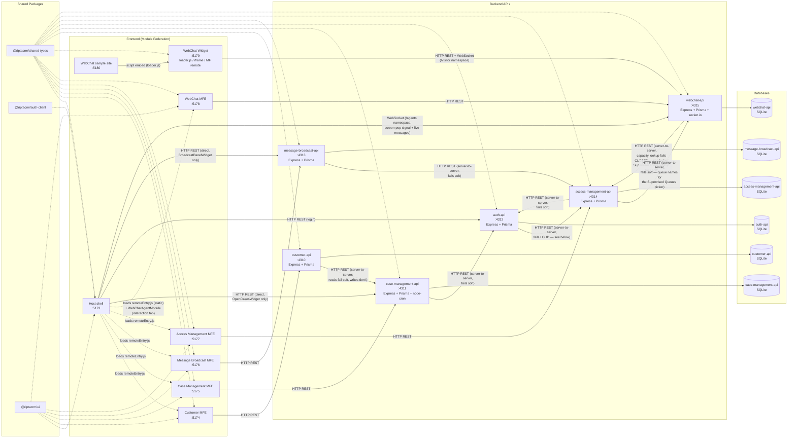

# RiptaCRM Architecture

How the modules are wired together at runtime: which frontends load which via Module Federation, which backends they call, and which shared packages each depends on.

## Nodes

| Node | Tech | Port | Role |
|---|---|---|---|
| Host | React + Vite + MUI + react-router, Module Federation **host** | 5173 | Shell app: login, nav, dashboard, hosts the four remotes |
| Customer MFE | React + Vite, Module Federation **remote** (`customer`) | 5174 | Customer search / create / detail UI |
| Case Management MFE | React + Vite, Module Federation **remote** (`caseManagement`) | 5175 | Case-type / workflow admin config UI + action log viewer |
| Message Broadcast MFE | React + Vite, Module Federation **remote** (`messageBroadcast`) | 5176 | Admin composer + list UI for broadcast announcements |
| Access Management MFE | React + Vite, Module Federation **remote** (`accessManagement`) | 5177 | Profile CRUD/archive, user↔profile assignment, custom Menu Item CRUD, and a read-only Users overview |
| WebChat MFE | React + Vite, Module Federation **remote** (`webChat`) | 5178 | Admin config UI (Sites, Queues, Routing Rules, Capacity Overrides) + the agent-side live chat panel (`WebChatAgentModule`, loaded into a Host interaction tab) |
| WebChat widget | React + Vite, **not one app** — 3 build targets served from one static root | 5179 | `/loader/loader.js` (vanilla-TS `<script>` embed, injects a bubble + iframe), `/iframe/` (the iframe's own SPA), `/mfe/remoteEntry.js` (Module Federation remote `webChatWidget`, loaded dynamically like a custom Menu Item, not via Host's static remotes map) |
| WebChat sample site | Static multi-page site (Vite, no MF except one demo page) | 5180 | Home / Pricing / Support pages embedding the widget via `<script>`, plus a React page dynamically loading the MF embed — demonstrates both embed paths against real, distinct page paths for routing rules to match against |
| customer-api | Express + Prisma + SQLite | 4310 | Customer & interaction-history REST API |
| case-management-api | Express + Prisma + SQLite + node-cron | 4311 | Case type / workflow / instance / SLA REST API + SLA scheduler |
| auth-api | Express + Prisma + SQLite | 4312 | Login / JWT issuance REST API — bcrypt-hashed passwords; resolves the logged-in user's Profile(s) from access-management-api on every login (see below); also a minimal `GET /api/users` read endpoint (auth-required) used by case-management-api's and access-management-api's member pickers |
| message-broadcast-api | Express + Prisma + SQLite | 4313 | Broadcast announcement CRUD + profile/validity-filtered active-list REST API |
| access-management-api | Express + Prisma + SQLite | 4314 | Profile CRUD/archive + user↔profile membership REST API — the source of truth for what every session's Profile grants |
| webchat-api | Express + Prisma + SQLite + socket.io | 4315 | Site/Queue/RoutingRule/CapacityOverride admin CRUD, conversation assign/claim/message REST API, a public unauthenticated `/api/public/*` router for the widget, and a `socket.io` server (`/visitor` + `/agents` namespaces) for real-time delivery |

## Shared packages

| Package | Contains | Consumed by |
|---|---|---|
| `@riptacrm/shared-types` | Cross-cutting TS types/DTOs (customer, case, interaction, nav, nav registry, user, profile, broadcast, webchat, worklist) | All services, including the WebChat widget (but see below) |
| `@riptacrm/auth-client` | Auth context + JWT-backed API auth provider (`useAuth()`) | Host only — deliberately **not** the WebChat widget, which has no logged-in session of its own to provide (see below) |
| `@riptacrm/ui` | Shared MUI theme, dynamic form renderer, `formatDateTime`/`formatDateOnly` | Host, Customer MFE, Case Management MFE, Message Broadcast MFE, Access Management MFE, WebChat MFE |

## The asymmetric edges

Every other cross-service call is straightforward — each MFE talks only to its own backend, and cross-service data flows through the caller's own backend as a server-to-server proxy. `customer-api` calls `case-management-api` server-to-server both to embed a customer's open cases into `GET /api/customers/:id` (read, fails soft) and — for the Customer module's "Lodge a Case" flow — to list lodgeable case types, fetch a case type version's fields, and create the case instance itself (`POST /api/case-instances`, the first *write* proxy in the codebase; deliberately **not** fail-soft, since a write failure has to reach the user as a real error, not get swallowed into a fake success). `case-management-api` and, more recently, `access-management-api` each call `auth-api` server-to-server (`GET /api/users`, fails soft to an empty list) so their member pickers (Queues; Profiles) can offer a real user list instead of free-typed IDs. `message-broadcast-api` calls `access-management-api` the same way (`GET /api/profiles`, fails soft to an empty list) to power its composer's "target profiles" checkbox list.

Three edges genuinely deviate from that pattern:

- **The Host's Dashboard widgets** — **"Open Cases" widget** calls `case-management-api` directly from the browser (`GET /api/case-instances?assignedToUserId=...&status=OPEN`), and **"Announcements" (`BroadcastPanelWidget`)** calls `message-broadcast-api` directly (`GET /api/broadcasts/active?profileId=...`) — both bypass their MFE and any other backend entirely. This is intentional in both cases — the data each widget needs (cases assigned to the logged-in user; announcements active for the logged-in user's active Profile) isn't scoped to a specific customer or record, so routing either through `customer-api` or the Case Management/Message Broadcast MFEs wouldn't make sense.
- **`auth-api` → `access-management-api` on login** (`GET /api/profiles?userId=...`) is the one edge in the whole codebase that deliberately **fails loud** instead of soft. Every other cross-service read here degrades gracefully — a shorter picker list, an empty widget — because the caller can still do something useful with partial data. Login can't: if `access-management-api` is unreachable, silently proceeding would mean handing back a token for a session with `navItemIds: []` — authenticated, but invisibly and confusingly locked out of everything. Instead `POST /api/auth/login` (and its `POST /api/auth/select-profile` counterpart) returns `503` and issues no token at all, so the failure is loud and obvious rather than a mystery blank UI.

Don't "fix" any of these three into a Module Federation call or a fail-soft proxy without checking why they're built the way they are first.

Each API owns its own isolated SQLite database via its own Prisma schema — there is no shared database and no direct DB-to-DB access.

## Profiles: the one active-per-session access-control concept

`access-management-api` owns `Profile` (a name, a `dashboardType` of `"frontline"` or `"admin"`, a `canStartInteractions` capability, and a set of granted nav-item ids), `ProfileNavItem`, and `ProfileUser`. Like `Queue`/`QueueMember` in `case-management-api`, `ProfileUser.userId` is a plain, unvalidated string — this service has no `User` model of its own; `auth-api` owns that. A granted nav-item id is either one of the fixed, compile-time ids in `@riptacrm/shared-types`'s `ALL_NAV_ITEMS`, or the id of an admin-created `MenuItem` row in this same service — see "Custom Menu Items" below for how those resolve.

A user can be assigned **any number** of Profiles (`ProfileUser` is many-to-many), but a login session is always scoped to exactly **one** active Profile at a time — there's no merging of multiple profiles' grants. If a user holds only one Profile, login resolves it and issues a token in a single round trip, same as before this module existed. If they hold more than one, `POST /api/auth/login` instead returns a short-lived pre-auth token and the list of profile names; the client calls `POST /api/auth/select-profile` with the chosen one to get the real session token. Nav visibility, route access, dashboard layout, and "can start interactions" are all derived from whichever single Profile is active for that session — nothing is unioned across profiles.

One seeded Profile ("Business Admin") is `isProtected`: it can be renamed and have its other nav items changed, but `access-management-api` rejects any attempt to archive it, delete it, or strip it of the one nav item that grants access to Access Management itself — without that guard, an admin could accidentally lock every admin (including themselves) out of the only screen that can fix it. Archiving (`archivedAt`, a nullable timestamp set via `POST /profiles/:id/archive` — mirroring `MessageBroadcast.canceledAt`/`POST /broadcasts/:id/cancel`, the one other soft-delete precedent in this codebase) and hard deletion are both blocked while a Profile still has members; unassign them first.

## Custom Menu Items: admin-configured iframe / dynamic Module Federation

Beyond the fixed, compile-time nav-item registry, `access-management-api`'s `MenuItem` model lets an admin create new grantable menu entries at runtime — each is either `displayType: "IFRAME"` (any URL, rendered in a plain `<iframe>`, no allowlist) or `displayType: "MFE"` (a Module Federation remote loaded **dynamically at runtime**, not one of Host's 4 statically-declared remotes). A `MenuItem`'s id is just another string a `ProfileNavItem.navItemId` can reference — deleting a `MenuItem` that's still granted needs no guard (unlike deleting a Profile); it just silently stops resolving next login, the same trust model as every other cross-referenced string id in this codebase.

Because custom items aren't known at compile time, `access-management-api`'s `toProfile()` mapper resolves the subset of a Profile's granted ids that *aren't* in `ALL_NAV_ITEMS` into full `MenuItem` objects and returns them as `customMenuItems` alongside the existing `navItemIds` — this is what lets `auth-api` bake full label/type/url metadata for custom items into the session JWT in the same login request that already resolves the active Profile, with no extra round trip. Host's `SideMenu` renders `customMenuItems` appended after the built-in list, each pointing at the one generic dynamic route, `/custom/:menuItemId` (`CustomMenuItemPage`) — there's no way to generate N static routes for an admin-defined, open-ended set of ids, so this single route does its own auth check inline (is this id in the session's `customMenuItems`?) instead of going through `NavItemRoute`.

**Dynamic remote loading** (`apps/host/src/shell/widgets/DynamicRemote.tsx`) uses `@module-federation/runtime`'s `registerRemotes()`/`loadRemote()` directly — the lower-level SDK that Host's `@module-federation/vite` plugin sits on top of, already resolved transitively but made an explicit Host dependency for this. This coexists with Host's static `remotes` map in `vite.config.ts` with zero config changes; the two registration paths (build-time static, runtime dynamic) feed the same underlying runtime instance. One easy-to-hit footgun, confirmed while building this: the consumer-side `loadRemote("remoteName/exposedName")` specifier does **not** repeat the leading `"./"` that a remote's own `exposes` key conventionally has (e.g. a remote exposing `"./SomeModule"` is loaded as `loadRemote("remoteName/SomeModule")`, not `"remoteName/./SomeModule"`) — `DynamicRemote` strips a leading `./` from the admin-entered exposed-module value defensively so either form works. A second gotcha: `entryGlobalName` must be the remote's own declared federation `name` (baked into its bundle at build time), not a locally-chosen alias — the "Remote name" field an admin fills in is genuinely asking for that upstream identity, not a label of their choosing.

**Security posture** (confirmed with the user while designing this): a dynamically-loaded remote executes in Host's own origin, completely unsandboxed — the moment it's loaded, it already has ambient access to everything that origin has (`sessionStorage`, including the session JWT; the DOM; cookies). That access exists the instant Host chooses to dynamically-load-and-mount arbitrary remote code at all — it is not something withheld or granted afterward by choosing what props to pass. So `DynamicRemote` passes the full `AuthSession` (including the raw token) as a `session` prop to the loaded component: a well-behaved remote gets a clean contract instead of reverse-engineering `sessionStorage`'s key/shape itself, and a malicious one gains nothing it didn't already have. The iframe case is genuinely different — that's a real, uncrossed origin boundary — and deliberately gets **no** identity pushed into it by default (no `postMessage`, no query params); that would be a real information disclosure, not a no-op, if added later.

## Auth: client-side JWT, no `/me` endpoint, two-step for multi-profile users

`auth-api` exposes `POST /api/auth/login`, `POST /api/auth/select-profile`, and `GET /api/users` (plus `/health`). Login signs a JWT containing the user's id/name/email and their **active Profile's** id/name/dashboardType/canStartInteractions/navItemIds, and returns it; the Host decodes and checks the token's expiry **locally**, with no further network calls to `auth-api` on page load or navigation — there's deliberately no `/me` or refresh endpoint yet. A change to a user's Profile assignment, or to a Profile's grants, only takes effect the next time that user logs in (or their 8h token expires) — accepted staleness, not a bug, consistent with the no-`/me` design. This keeps the login flow snappy (no round trip just to render the shell) and matches how modern SSO/OIDC bridges (including SAML gateways) already speak JWT, so swapping the credential-checking logic behind `POST /api/auth/login` for a real identity provider later doesn't require changing how the rest of the app consumes `useAuth()`.

## Authorization: every backend route is gated, not just the UI

Every route on all 5 backends (`customer-api`, `case-management-api`, `message-broadcast-api`, `access-management-api`, `auth-api`'s `GET /api/users`) is protected by a `requirePermission(navItemId?)` Express middleware — one identical copy per service (`src/lib/requirePermission.ts`), matching this codebase's existing per-service-copy convention (e.g. `prismaErrors.ts`) rather than a shared package. Before this, every check built into the UI (`NavItemRoute`, custom menu items, the Customer MFE's feature-gated Search/Profile/Amend/Lodge-a-Case screens) was UI-only — any of these endpoints could be called directly with no credential at all. `POST /api/auth/login` and `POST /api/auth/select-profile` are the sole exception, staying fully public since they *are* the entry point that issues the credential everything else checks.

A route accepts either:
- **An end-user JWT** (`Authorization: Bearer <token>`) — verified against the same `JWT_SECRET` `auth-api` signs with (this service only verifies, never signs). If the middleware was given a `navItemId`, the token's `navItemIds` claim must include it, or the request gets `403`. Called with no `navItemId` (`requirePermission()`), any authenticated user passes — used for routes several unrelated Profiles legitimately need (e.g. `GET /api/case-instances`, `GET /api/broadcasts/active`).
- **A trusted service-to-service call** (`X-Internal-Service-Key: <key>`) — a shared `INTERNAL_SERVICE_KEY` env var, identical across all 5 services, checked first and bypassing the permission check entirely when it matches. This is what lets the same route serve both a browser request *and* another backend's proxy without two code paths or two routes — e.g. `case-management-api`'s `GET /api/case-types` is called by an admin browser session (needs `case-management-config`) *and* by `customer-api`'s Lodge-a-Case proxy (no user context at all); `access-management-api`'s `GET /api/profiles` is called by the Access Management admin screen *and*, key-authenticated, by `auth-api`'s login flow before any user JWT exists yet. Every server-to-server `fetch` in the codebase (the ones listed under "The asymmetric edges" above, plus the 4 MFE-proxy reads) now sends this header.

Both `JWT_SECRET` and `INTERNAL_SERVICE_KEY` are dev-only insecure fallback constants today (same "known simplification" posture already documented on `JWT_SECRET` in `auth-api/src/lib/jwt.ts`) — acceptable for this increment, not production-hardened secret management.

The Customer MFE's 5 feature grants from "Profiles" above (`customer-search`, `customer-create`, `customer-profile`, `customer-amend`, `customer-lodge-case`) are real `requirePermission(...)` arguments on `customer-api`'s routes now, not just UI state — `GET /api/customers/search` and `GET /api/customers/:id` require `customer-search`; `POST /api/customers` requires `customer-create`; `POST /api/case-instances` (the lodge-a-case proxy) requires `customer-lodge-case`. The other three (`customer-profile`, `customer-amend`) gate UI only — Amend Customer has no backend endpoint yet ("Coming soon"), and Profile is just a read already covered by `customer-search`.

**Deliberately out of scope**: no per-record ownership checks (e.g. "only the assigned user can transition their own case," "a frontline user can only see their own open cases") — this is permission-level gating only (is this user authenticated, does their Profile grant this specific action), the same granularity the UI-only checks already implied. Adding ownership enforcement is a distinct, larger change, not a gap in this refactor.

Every MFE now threads an `authToken` prop from the Host's `useAuth()` session down through its exposed module to every API call (`apps/*/src/api/client.ts`'s shared `request()` helper takes an optional trailing `token`). The Customer MFE additionally threads `grantedFeatureIds?: string[]` (sourced from the session's `navItemIds` — no separate claim needed, since the 5 feature ids already live in that same array) down to `CustomerLookupModule` → `InteractionWorkspace`/`CustomerMenuBox`/`LodgeCaseForm`; `undefined` defaults to all 5 granted, so the MFE's standalone dev harness (`StandaloneApp.tsx`) still works without wiring up a fake grant list. `DynamicRemote.tsx` (see "Custom Menu Items" above) passes both `session` and `authToken={session.token}` to whatever it dynamically loads, since a remote built against either prop contract needs to keep working — a custom menu item's grant only controls whether the shell loads that remote at all, not what its own backend's `requirePermission` calls still require (e.g. a frontline user granted a dynamically-loaded Case Management menu item still needs `case-management-config` from their Profile to see any of its data, same as the statically-wired page).

## WebChat: the first public, unauthenticated endpoints

Every route documented under "Authorization" above requires either an end-user JWT or the service-to-service key — until `webchat-api`'s `/api/public/*` router. A visitor on a customer's website has no account and no login flow at all, so `requirePermission()` genuinely cannot apply there; these routes (`GET /sites/:siteKey/prechat-fields`, `POST /conversations`, `POST /conversations/:id/messages`, `GET /conversations/:id`) carry **no** auth middleware whatsoever, mounted before (and with different CORS handling than) the rest of the API in `app.ts`.

The trust model is narrower, not absent:
- **`siteKey`** — a per-`Site` value embedded directly in the widget's loader script or MF module props. Not secret (it's shipped to every visitor's browser by design, same posture as, say, a Stripe publishable key), but every public route validates it resolves to a real, active `Site` before doing anything else.
- **Dynamic CORS, not a static allowlist** — `lib/originValidator.ts`'s `publicCors(req, callback)` looks up the `Site` by the request's `siteKey` and only allows the request's `Origin` if it's empty (`allowedOrigins` unset → accept any, the default for a fresh Site) or an exact match against that Site's configured comma-separated list. This has to be a per-request lookup, not a fixed origin list like every other backend's `cors({ origin: adminOrigins })`, because a public endpoint doesn't know in advance which of N different customer domains might legitimately embed which Site.
- **Rate limiting** (`express-rate-limit`), keyed by `siteKey` (falling back to IP) — 60/min for starting a conversation, 120/min for sending a message — the only rate-limited routes in the codebase, because these are the only ones reachable by an anonymous, unauthenticated caller at all.

None of this weakens `requirePermission()` anywhere else — it's a narrow, deliberate carve-out for the one surface in the app that structurally cannot have a session, not a precedent for skipping auth elsewhere.

## WebChat: real-time via socket.io, writes stay REST

Unlike Message Broadcast's interval polling (below), WebChat needs genuine low-latency, two-way delivery — a visitor typing on an arbitrary third-party network and an agent expecting a near-instant screen-pop don't tolerate a 45-second poll window. `webchat-api` runs one `socket.io` `Server` attached to the same `http.Server` Express already listens on (`src/ws/socketServer.ts`'s `attachSocketServer()`, stored on `app.locals.io`), split into two **namespaces** — `/visitor` (handshake `{siteKey, conversationId}`, joins `conversation:<id>`) and `/agents` (handshake `{token}`, verified the same way `requirePermission` verifies a JWT, requires `webchat-agent` or `webchat-config`, joins `agent:<userId>` and, per-open-tab, `conversation:<id>`).

**Every write still goes through an ordinary REST call** — starting a conversation, sending a message, assigning, claiming. A route handler commits the Prisma write first, then emits a socket event to the relevant room(s) once it's durable. Sockets are broadcast-only; they never carry a mutation. This keeps exactly one code path to test with supertest (`createApp()` has no live socket server attached, and every emit call is written to no-op safely when `app.locals.io` is `undefined`), independent of whether a real socket server is running.

**A namespace's rooms are private to that namespace** — `io.to("someRoom")` (bare, no `.of(...)`) operates on the default `"/"` namespace, which nothing in this app ever connects to, so it silently emits to nobody. Since a conversation has members in *both* `/visitor` and `/agents` (each joins a same-named `conversation:<id>` room, but in their own namespace's separate room registry), broadcasting a conversation event needs to explicitly target both — see `emitToConversationRoom()`/`emitToAgent()` in `socketServer.ts`, the only correct way to emit from a route handler. This was a real bug caught by this feature's own e2e spec: every emit initially used the bare form, so `chat:assigned` and `message:new` were computed and "sent" correctly but delivered to an empty namespace and silently dropped — the fix is now the only emit path used anywhere in this service.

**Capacity resolution fails closed, not soft**: `services/routeConversation.ts`'s `resolveEffectiveCapacity(userId)` checks a local `AgentCapacityOverride` first (no network call), else calls `access-management-api`'s `GET /api/profiles/default-webchat-capacity?userId=...`. If that call fails, effective capacity is `0` — the conversation stays queued rather than risking a silent over-assignment to an agent whose real capacity couldn't be confirmed. This is the opposite default from every other cross-service read in this codebase (which fails soft to an empty/degraded result); a live customer conversation being delayed is a much smaller problem than one being silently dropped onto an already-overloaded agent.

**Supervisor Dashboard: same edge, opposite failure posture.** `services/resolveSupervisorScope.ts` calls the same `access-management-api` used for capacity resolution, but to resolve a Supervisor's granted queues/profiles (`GET /api/profiles/:id`) — this one fails soft (empty scope), since it's powering a display, not a routing decision that risks over-assigning a live chat. The reverse edge (`access-management-api`'s `GET /api/webchat-queues` proxying `webchat-api`'s `GET /queues`, powering a Profile's Supervised Queues picker) also fails soft. Visibility itself is a union of two independent grants — `ProfileSupervisedQueue` (queue membership, a plain unvalidated `queueId` mirroring `ProfileUser.userId`'s cross-service trust model) and `ProfileSupervisedProfile` (a real local FK, since Profiles are local to `access-management-api`) — computed by the pure `lib/supervisorVisibility.ts`.

## Message Broadcast: interval polling, not long-polling or WebSockets

`BroadcastPanelWidget` re-fetches `GET /api/broadcasts/active?profileId=...` on a 45-second `setInterval`, not via long-polling or a WebSocket — this is the first (and so far only) auto-refreshing UI in the codebase. Interval polling was chosen deliberately: every other piece of client-server communication in this app is a one-shot REST call, so a plain timer keeps the same mental model, and because each tick is a fresh, stateless request, there's no open-connection state to track or recover if it drops — unlike long-polling, which needs its own "resume polling if nothing came back for a while" logic. `/active` still requires *some* valid session (any authenticated user, no specific Profile grant) — see "Authorization" below — so it's an authenticated poll, not a public subscription. Broadcast targeting (`MessageBroadcastTargetProfile.profileId`) is, like `ProfileUser.userId`, a plain unvalidated string — creating/updating a broadcast never cross-checks `targetProfileIds` against `access-management-api`, so a degraded "target profiles" picker can never cause a valid broadcast to be rejected.

## Queues: auto-assign or route, decided server-side at lodge time

A `Queue` (`case-management-api`) is just a name plus a list of member user ids (plain strings, unvalidated — `case-management-api` has no `User` model of its own; membership is checked, never joined, against `auth-api`'s data). A `StageDefinition` can optionally have a `queueId`. When the Customer module's "Lodge a Case" form calls `POST /api/case-instances` with a `lodgedByUserId` (the logged-in frontline user's id, threaded in from the Host — the Customer MFE has no `@riptacrm/auth-client` dependency of its own, matching every other MFE), `case-management-api` looks at the new case's starting stage: no queue on the stage → unchanged, unassigned; queue present and the lodging user is a member → auto-assigned to them; queue present and they're not a member → the case's `assignedQueueId` is set instead of `assignedToUserId`, and the response carries the queue's name back so the UI can tell the user their case was routed rather than claimed. An explicit `assignedToUserId` in the request (the only way the admin's "Create Test Case Instance" screen has ever populated assignment) always wins over this logic and skips it entirely — `lodgedByUserId` is a new, separate field that only the Lodge-a-Case flow sends.

`webchat-api` owns its own `WebChatQueue`/`WebChatQueueMember` tables, structurally identical to `case-management-api`'s `Queue`/`QueueMember` — a deliberate **duplicate**, not a reuse. Every other cross-service data need in this codebase goes through a server-to-server proxy call; queues specifically don't, because WebChat's routing has to run synchronously, in the hot path of assigning a just-arrived live conversation, and a hard runtime dependency on another service being up would mean a `case-management-api` outage could also break WebChat intake. The accepted cost: an agent who works both cases and chats needs two separate queue-membership rows (one in each service), added by two different admin screens.
