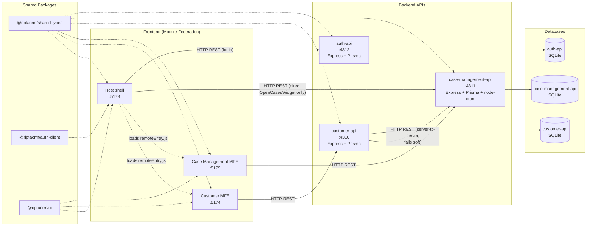

# RiptaCRM Architecture

How the modules are wired together at runtime: which frontends load which via Module Federation, which backends they call, and which shared packages each depends on.

## Nodes

| Node | Tech | Port | Role |
|---|---|---|---|
| Host | React + Vite + MUI + react-router, Module Federation **host** | 5173 | Shell app: login, nav, dashboard, hosts the two remotes |
| Customer MFE | React + Vite, Module Federation **remote** (`customer`) | 5174 | Customer search / create / detail UI |
| Case Management MFE | React + Vite, Module Federation **remote** (`caseManagement`) | 5175 | Case-type / workflow admin config UI + action log viewer |
| customer-api | Express + Prisma + SQLite | 4310 | Customer & interaction-history REST API |
| case-management-api | Express + Prisma + SQLite + node-cron | 4311 | Case type / workflow / instance / SLA REST API + SLA scheduler |
| auth-api | Express + Prisma + SQLite | 4312 | Login / JWT issuance REST API — bcrypt-hashed passwords, no other endpoints |

## Shared packages

| Package | Contains | Consumed by |
|---|---|---|
| `@riptacrm/shared-types` | Cross-cutting TS types/DTOs (customer, case, interaction, nav, user, auth) | All 6 services |
| `@riptacrm/auth-client` | Auth context + JWT-backed API auth provider (`useAuth()`) | Host only |
| `@riptacrm/ui` | Shared MUI theme | Host, Customer MFE, Case Management MFE |

## The one asymmetric edge

Every other cross-service call is straightforward — each MFE talks only to its own backend, and `customer-api` calls `case-management-api` server-to-server to embed a customer's open cases into `GET /api/customers/:id`.

The Host's Dashboard **"Open Cases" widget is the exception**: it calls `case-management-api` directly from the browser (`GET /api/case-instances?assignedToUserId=...&status=OPEN`), bypassing both `customer-api` and the Case Management MFE entirely. This is intentional — the widget needs cases assigned to the logged-in user, not tied to a specific customer, so routing it through `customer-api` wouldn't make sense. Don't "fix" this into a Module Federation call or a customer-api proxy without checking why it's a direct call first.

Each API owns its own isolated SQLite database via its own Prisma schema — there is no shared database and no direct DB-to-DB access.

## Auth: client-side JWT, no `/me` endpoint

`auth-api` only exposes `POST /api/auth/login` (plus `/health`). It signs a JWT containing the user's id/name/email/role and returns it; the Host decodes and checks the token's expiry **locally**, with no further network calls to `auth-api` on page load or navigation — there's deliberately no `/me` or refresh endpoint yet. This keeps the login flow snappy (no round trip just to render the shell) and matches how modern SSO/OIDC bridges (including SAML gateways) already speak JWT, so swapping the credential-checking logic behind `POST /api/auth/login` for a real identity provider later doesn't require changing how the rest of the app consumes `useAuth()`.
